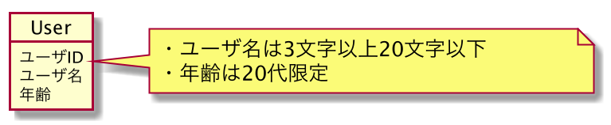

# ORMを利用したリポジトリの実装

ORMを利用してのリポジトリ実装をとても小さいテーブルで試しました。あまり見かけないので。

## Environment
- Python(3.7.0)
- SQLite3(2.6.0)
- Orator(0.9)
    - [Documentation | Orator - An ActiveRecord ORM for Python](https://orator-orm.com/docs/0.9/)

## Domain Model

## DB Schema
| Column | DataType |
| ------ | -------- |
| id     | VARCHAR  |
| name   | VARCHAR  |
| age    | INTEGER  |

## Usage
- `init_db.main()` を実行してDBとテーブルを作成する。
- あとはご自由に。

## References
- [ドメイン駆動設計入門 ボトムアップでわかる！ドメイン駆動設計の基本（成瀬允宣）](https://www.shoeisha.co.jp/book/detail/9784798150727)
  - Chapter05を主に参考にしています。
    - [Chapter05のサンプルコード: itddd/SampleCodes/Chapter5 at master · nrslib/itddd](https://github.com/nrslib/itddd/tree/master/SampleCodes/Chapter5/)
- [WEB+DB PRESS Vol.113 | Gihyo Digital Publishing](https://gihyo.jp/dp/ebook/2019/978-4-297-10906-6)
    - 「4章 ドメイン駆動設計の実装パターン - ベストプラクティスを実例で学ぶ」を参考にしています。   